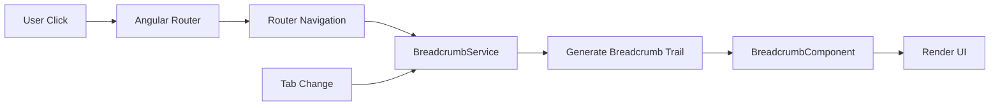

# Design Document: Breadcrumb Standardization

## Overview

This design establishes a centralized breadcrumb service and reusable component for Angular that provides consistent, accessible navigation across the application. The solution replaces hardcoded breadcrumb implementations with a dynamic system that automatically generates breadcrumb trails based on route configuration and component state.

The design follows Angular best practices using standalone components, signals for reactive state management, and the Angular Router for navigation. The breadcrumb component will be injected into existing page headers, maintaining visual consistency while providing enhanced functionality.

## Architecture

### Component Structure

```
BreadcrumbService (Injectable)
├── Manages breadcrumb state
├── Provides route-to-breadcrumb mapping
└── Exposes breadcrumb data as signals

BreadcrumbComponent (Standalone)
├── Consumes BreadcrumbService
├── Renders breadcrumb trail
└── Handles navigation clicks

Page Components
├── Inject BreadcrumbComponent
└── Optionally update breadcrumb context (for tabs)
```

### Data Flow



## Components and Interfaces

### BreadcrumbService

The service manages breadcrumb state and provides methods for generating breadcrumb trails.

```typescript
interface BreadcrumbSegment {
  label: string;
  route: string | null;  // null for current page (non-clickable)
  icon?: string;
}

@Injectable({ providedIn: 'root' })
class BreadcrumbService {
  private breadcrumbs = signal<BreadcrumbSegment[]>([]);
  
  // Public readonly signal
  breadcrumbs$ = this.breadcrumbs.asReadonly();
  
  constructor(
    private router: Router,
    private activatedRoute: ActivatedRoute
  ) {
    // Subscribe to router events to update breadcrumbs
    this.router.events
      .pipe(filter(event => event instanceof NavigationEnd))
      .subscribe(() => this.updateBreadcrumbs());
  }
  
  // Generate breadcrumbs from current route
  private updateBreadcrumbs(): void;
  
  // Allow components to set custom breadcrumb context (for tabs)
  setContext(context: string): void;
  
  // Clear custom context
  clearContext(): void;
}
```

### BreadcrumbComponent

A standalone component that renders the breadcrumb trail.

```typescript
@Component({
  selector: 'app-breadcrumb',
  standalone: true,
  template: `
    <nav class="breadcrumb" aria-label="Breadcrumb">
      @for (segment of breadcrumbs(); track segment.label; let isLast = $last) {
        @if (!isLast && segment.route) {
          <a [routerLink]="segment.route" class="breadcrumb-link">
            {{ segment.label }}
          </a>
        } @else {
          <span [class.current]="isLast">{{ segment.label }}</span>
        }
        @if (!isLast) {
          <mat-icon aria-hidden="true">chevron_right</mat-icon>
        }
      }
    </nav>
  `
})
class BreadcrumbComponent {
  private breadcrumbService = inject(BreadcrumbService);
  breadcrumbs = this.breadcrumbService.breadcrumbs$;
}
```

### Route Configuration

Routes will be enhanced with breadcrumb metadata:

```typescript
const routes: Routes = [
  {
    path: 'dashboard',
    component: DashboardComponent,
    data: { breadcrumb: 'Dashboard' }
  },
  {
    path: 'modules/user-management',
    component: UserManagementComponent,
    data: { breadcrumb: 'User Management' }
  },
  {
    path: 'modules/client-management',
    component: ClientManagementComponent,
    data: { breadcrumb: 'Client Management' }
  },
  {
    path: 'modules/catalogue',
    component: CatalogueComponent,
    data: { breadcrumb: 'Catalogue' }
  },
  {
    path: 'modules/quotations',
    component: QuotationsComponent,
    data: { breadcrumb: 'Quotations' }
  },
  {
    path: 'modules/cms',
    component: CmsComponent,
    data: { breadcrumb: 'CMS' }
  },
  {
    path: 'search',
    component: SearchComponent,
    data: { breadcrumb: 'Global Search' }
  }
];
```

## Data Models

### BreadcrumbSegment

```typescript
interface BreadcrumbSegment {
  // Display text for the segment
  label: string;
  
  // Route path for navigation (null if non-clickable)
  route: string | null;
  
  // Optional icon (for future enhancement)
  icon?: string;
}
```

### BreadcrumbContext

```typescript
interface BreadcrumbContext {
  // Additional context (e.g., active tab name)
  context: string;
  
  // Timestamp for context updates
  timestamp: number;
}
```

## Correctness Properties

*A property is a characteristic or behavior that should hold true across all valid executions of a system—essentially, a formal statement about what the system should do. Properties serve as the bridge between human-readable specifications and machine-verifiable correctness guarantees.*

### Property 1: Dashboard Root Consistency

*For any* page navigation event (excluding the Dashboard page itself), the breadcrumb trail should start with a "Dashboard" segment that routes to '/dashboard'.

**Validates: Requirements 2.1, 2.2, 2.4**

### Property 2: Legacy Prefix Removal

*For any* breadcrumb trail, no segment should have the label "Pages" or "Modules".

**Validates: Requirements 1.1, 1.2**

### Property 3: Current Page Non-Clickability

*For any* breadcrumb trail, the final segment should have a null route value, making it non-clickable.

**Validates: Requirements 3.3**

### Property 4: Non-Current Segments Clickable

*For any* breadcrumb segment that is not the final segment, it should have a non-null route value and be rendered as a clickable link.

**Validates: Requirements 3.1**

### Property 5: Clickable Segment Navigation

*For any* breadcrumb segment with a non-null route, clicking that segment should trigger Angular Router navigation to the specified route.

**Validates: Requirements 3.2**

### Property 6: Tab Context Updates

*For any* module with tabs, when the active tab changes, the breadcrumb trail should update to reflect the new tab name as the final segment.

**Validates: Requirements 4.2**

### Property 7: Module With Tabs Format

*For any* module page with tabs, the breadcrumb trail should follow the format [Dashboard, Module Name, Active Tab] with exactly three segments, where the tab name is the final segment.

**Validates: Requirements 4.1, 4.4**

### Property 8: Module Without Tabs Format

*For any* module page without tabs, the breadcrumb trail should follow the format [Dashboard, Module Name] with exactly two segments.

**Validates: Requirements 4.3**

### Property 9: Non-Module Page Format

*For any* non-module, non-dashboard page, the breadcrumb trail should follow the format [Dashboard, Page Name] with exactly two segments.

**Validates: Requirements 6.3**

### Property 10: Dashboard Page Simplicity

*For any* navigation to the Dashboard page, the breadcrumb trail should contain exactly one segment with label "Dashboard" and null route.

**Validates: Requirements 1.3, 2.3**

### Property 11: Accessibility Nav Element

*For any* rendered breadcrumb component, the root element should be a `<nav>` element with `aria-label="Breadcrumb"`.

**Validates: Requirements 7.1**

### Property 12: Accessibility Chevron Icons

*For any* chevron icon rendered in the breadcrumb, it should have the attribute `aria-hidden="true"`.

**Validates: Requirements 7.3**

### Property 13: Keyboard Navigation Support

*For any* clickable breadcrumb segment, it should be keyboard focusable and respond to Enter key press for navigation.

**Validates: Requirements 7.5**

## Error Handling

### Missing Route Data

**Scenario:** A route lacks breadcrumb metadata in its configuration.

**Handling:** 
- Service falls back to deriving breadcrumb label from route path
- Convert kebab-case to Title Case (e.g., 'user-management' → 'User Management')
- Log warning in development mode

### Invalid Route Navigation

**Scenario:** User clicks a breadcrumb segment with an invalid route.

**Handling:**
- Angular Router handles navigation errors
- Display error message via MatSnackBar
- Breadcrumb remains in current state

### Context Update Race Conditions

**Scenario:** Multiple rapid tab changes cause context updates to overlap.

**Handling:**
- Use timestamp-based context updates
- Only apply context if timestamp is newer than current
- Debounce context updates with 50ms delay

## Testing Strategy

### Unit Tests

Unit tests will validate specific examples and edge cases:

- Dashboard page shows only "Dashboard" breadcrumb
- Module page without tabs shows "Dashboard > Module Name"
- Module page with tabs shows "Dashboard > Module Name > Tab Name"
- Clicking "Dashboard" segment navigates to '/dashboard'
- Current page segment is not clickable
- Missing route data falls back to path-derived label
- Chevron icons have aria-hidden="true"
- Nav element has aria-label="Breadcrumb"

### Property-Based Tests

Property-based tests will verify universal properties across all inputs. Each test will run a minimum of 100 iterations with randomized inputs.

**Property Test 1: Dashboard Root Consistency**
- Generate random route paths (excluding '/dashboard')
- For each route, verify breadcrumb trail starts with Dashboard segment with route '/dashboard'
- Tag: **Feature: breadcrumb-standardization, Property 1: Dashboard Root Consistency**

**Property Test 2: Legacy Prefix Removal**
- Generate random breadcrumb trails with various segment labels
- For each trail, verify no segment has label "Pages" or "Modules"
- Tag: **Feature: breadcrumb-standardization, Property 2: Legacy Prefix Removal**

**Property Test 3: Current Page Non-Clickability**
- Generate random breadcrumb trails
- For each trail, verify final segment has null route value
- Tag: **Feature: breadcrumb-standardization, Property 3: Current Page Non-Clickability**

**Property Test 4: Non-Current Segments Clickable**
- Generate random breadcrumb trails with multiple segments
- For each non-final segment, verify it has a non-null route value
- Tag: **Feature: breadcrumb-standardization, Property 4: Non-Current Segments Clickable**

**Property Test 5: Clickable Segment Navigation**
- Generate random breadcrumb segments with routes
- For each segment, simulate click and verify Router.navigate called with correct route
- Tag: **Feature: breadcrumb-standardization, Property 5: Clickable Segment Navigation**

**Property Test 6: Tab Context Updates**
- Generate random tab names for a module
- For each tab change, verify breadcrumb updates to include new tab name as final segment
- Tag: **Feature: breadcrumb-standardization, Property 6: Tab Context Updates**

**Property Test 7: Module With Tabs Format**
- Generate random module names and tab names
- For each combination, verify breadcrumb has exactly 3 segments: [Dashboard, Module, Tab]
- Tag: **Feature: breadcrumb-standardization, Property 7: Module With Tabs Format**

**Property Test 8: Module Without Tabs Format**
- Generate random module names
- For each module, verify breadcrumb has exactly 2 segments: [Dashboard, Module]
- Tag: **Feature: breadcrumb-standardization, Property 8: Module Without Tabs Format**

**Property Test 9: Non-Module Page Format**
- Generate random page names (non-module, non-dashboard)
- For each page, verify breadcrumb has exactly 2 segments: [Dashboard, Page]
- Tag: **Feature: breadcrumb-standardization, Property 9: Non-Module Page Format**

**Property Test 10: Dashboard Page Simplicity**
- Simulate navigation to dashboard route
- Verify breadcrumb has exactly 1 segment with label "Dashboard" and null route
- Tag: **Feature: breadcrumb-standardization, Property 10: Dashboard Page Simplicity**

**Property Test 11: Accessibility Nav Element**
- Generate random breadcrumb trails and render component
- For each rendered component, verify root element is <nav> with aria-label="Breadcrumb"
- Tag: **Feature: breadcrumb-standardization, Property 11: Accessibility Nav Element**

**Property Test 12: Accessibility Chevron Icons**
- Generate random breadcrumb trails with multiple segments
- For each chevron icon rendered, verify it has aria-hidden="true"
- Tag: **Feature: breadcrumb-standardization, Property 12: Accessibility Chevron Icons**

**Property Test 13: Keyboard Navigation Support**
- Generate random clickable breadcrumb segments
- For each segment, verify it is focusable and responds to Enter key for navigation
- Tag: **Feature: breadcrumb-standardization, Property 13: Keyboard Navigation Support**

### Integration Tests

- Test breadcrumb updates across actual route navigation
- Verify breadcrumb component integrates correctly in page headers
- Test tab switching in modules updates breadcrumbs
- Verify keyboard navigation works for breadcrumb links
